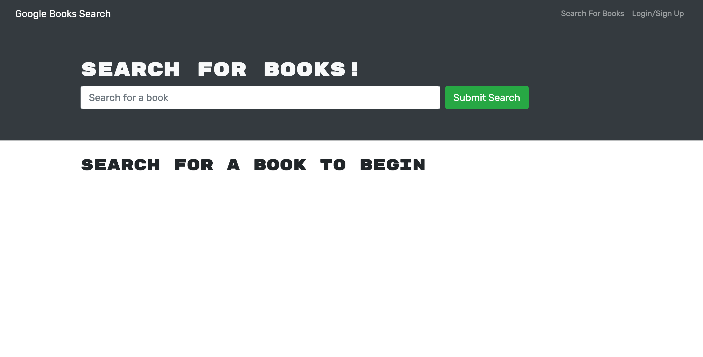

# Book Search

 

## Description
Book Search is a full stack MERN application. Book Search allows a user to search for any related book to the title search input using the Google Books API. Additionally, a user can create an account that provides access to save book functionality and dashboard. If a user logs out the saved books will persist.

Book Search was refractored from an existing MERN app to utilize GraphQL implementations. The original RESTful API structure was transitioned to a GraphQL API using an Apollo Server. This was done through GraphQL queries and mutations. The purpose of changing the API structure is GraphQL lets you ask for what you want in a single query, saving bandwidth and reducing waterfall requests. It also enables clients to request their own unique data specifications therefore making the app faster. As a MERN application Book Search is created using MongoDB, Express, React and Node.js. 

## Table of Contents
  - [Usage](#Usage)
  - [Installation](#installation)
  - [Technology Used](#technology-used)
  - [Questions](#questions)
  - [Links](#links)
  - [License](#license)
  
## Usage

#### Application Homepage:

 #### Application Search Results:

  
  ## Installation
  Node.js, NPM, and MongoDB must be installed on your computer.  
   Clone the repo:  
      `git clone https://github.com/CFsylvester/book-search.git`  
   Navigate to the root directory and run:  
      `npm install`  
   To start the server locally, run the following:  
      `npm start`  
   Navigate to <b>localhost:3000</b> in your browser to open the application locally.

  ## Technology/Dependencies Used
  
  
  
  
  
  
  
  
  
  
  
  
  
  
  
  
  
  
  
  
  
  
  
     
  
   
  
  ## Questions
  Please reach out to me at [clairesylvester@clairecodes.dev](mailto:clairesylvester@clairecodes.dev?subject=[GitHub%book-search]%20Source%20Han%20Sans)

  ## Links
  - **[Deployed App](https://sylvester-budget-tracker.herokuapp.com/)**
  - **[GitHub Repo](https://github.com/CFsylvester/book-search)**
  - **[My Portfolio](clairecodes.dev)**
  - **[Connect on LinkedIn](https://www.linkedin.com/in/claire-sylvester-386373143/)**
  - **[GitHub profile](https://github.com/CFsylvester)    **

  ## License 
  This application uses the MIT license.  
# Book-Search-Engine
